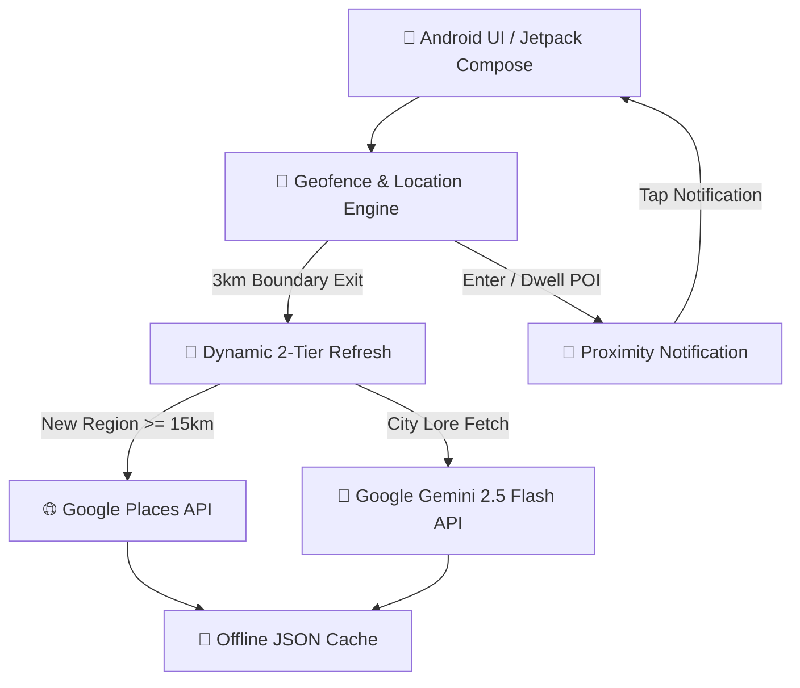

# 📍 LocalLore — Location-Aware Cultural Intelligence App

[](https://developer.android.com)
[](https://kotlinlang.org/)
[](https://developer.android.com/jetpack/compose)
[](https://ai.google.dev/)

**LocalLore** is a native, modern Android application that turns physical navigation into a rich, contextual exploration experience. Built with **Kotlin** and **Jetpack Compose**, LocalLore combines dynamic background geofencing with **Google Gemini AI** and **Wikipedia REST APIs** to deliver real-time historical chronicles, authentic local culinary insights, and proximity-based heads-up notifications as users explore their surroundings.

---

## 🌟 Key Features

- 🗺️ **Interactive Map View**: Integrated OpenStreetMap view to interactively explore points of interest (POIs) and attraction markers in real-time.
- 🏛️ **Nearby Attractions Discovery**: Queries Google Places API to surface curated tourist attractions, complete with rating breakdowns, opening hours, and Coil-rendered imagery.
- 📜 **Generative AI City History**: Leverages **Google Gemini 2.5 Flash API** to generate structured, factually accurate historical chronicles for the user's current city.
- 🍲 **Authentic Cultural & Culinary Lore**: AI-driven cultural guides focusing strictly on regional traditions and authentic local food specialties (excluding chain hotels and generic commercial spots).
- 🎯 **Dynamic Geofences**:
  - **3km Sliding Boundary**: Maintains a moving virtual boundary geofence to prevent continuous location polling and conserve battery life.
  - **Viewport-Calculated POI Radii**: Dynamically computes individual POI geofence radii (350m–600m) derived from Google Places geographic bounds.
  - **2-Tier Refresh Pipeline**: Performs a local *Soft Refresh* (3km–15km) to re-center geofences from cache without hitting external APIs, reserving *Hard Resets* (>= 15km) for cross-city transitions.
- 🔔 **Proximity Notifications & Deep Linking**: Triggers heads-up notifications with cooldown throttling when entering or dwelling in POIs, deep-linking straight into Compose detailed view overlays.
- ⚡ **Offline-First & Background Enrichment**: JSON/Room caching architecture paired with **Android WorkManager** for asynchronous Wikipedia lore enrichment.

---

## 🏗️ System Architecture



> 💡 **Scalability & Storage Considerations**
> 
> The current implementation uses file-based JSON caching (`nearby_attractions.json`, `city_lore_[city].json`, `wikipedia_progress.json`) for lightweight, zero-dependency offline storage. 
> 
> As the application scales to handle large-scale multi-city offline downloads, high-frequency spatial queries, and extensive POI datasets, the persistence layer should be migrated from flat JSON files to an indexed database (e.g., **Room / SQLite** with spatial indexing and FTS5 full-text search) or a distributed cloud cache layer (e.g., **Redis** / **Cloud Firestore**). This will eliminate file parsing overhead, optimize disk I/O, and ensure $O(1)$ query performance at scale.

---

## 🛠️ Tech Stack & Dependencies

- **Language**: [Kotlin](https://kotlinlang.org/)
- **UI Framework**: [Jetpack Compose](https://developer.android.com/jetpack/compose) with Material 3 Design
- **Image Loading**: [Coil Compose](https://coil-kt.github.io/coil/compose/)
- **Maps**: [OpenStreetMap (OsmDroid)](https://github.com/osmdroid/osmdroid)
- **Generative AI**: [Google Gemini 2.5 Flash / 1.5 Flash API](https://ai.google.dev/)
- **Geofencing & Location**: Google Play Services Location API (`GeofencingClient`, `FusedLocationProviderClient`)
- **Background Operations**: Android `WorkManager` (`CoroutineWorker`)
- **Networking**: `OkHttp3`, `Retrofit2`, `Gson`
- **Authentication**: Firebase Anonymous Auth

---

## 📁 Directory Structure

```text
LocalLore/
├── app/
│   ├── src/
│   │   └── main/
│   │       ├── java/com/example/locallore/
│   │       │   ├── MainActivity.kt               # Main entry point & Compose UI screens/tabs
│   │       │   ├── CityLoreService.kt            # Gemini API integration & city lore caching
│   │       │   ├── GeoFenceManager.kt            # Dynamic 3km boundary & POI geofence registrar
│   │       │   ├── GeofenceBroadcastReceiver.kt  # Background transition & notification handler
│   │       │   ├── LocationService.kt            # Nominatim geocoding & Google Places API client
│   │       │   ├── WikipediaService.kt           # Wikipedia summary parsing & enrichment
│   │       │   ├── WikipediaWorker.kt            # WorkManager background enrichment task
│   │       │   ├── PlacesRefreshWorker.kt        # Periodic attraction refresh task
│   │       │   ├── DebugLogger.kt                # In-app device logging utility
│   │       │   └── ui/theme/                     # Material 3 Color, Type & Theme configuration
│   │       └── AndroidManifest.xml
│   └── build.gradle.kts
├── build.gradle.kts
├── settings.gradle.kts
└── local.properties
```

---

## 🚀 Getting Started

### Prerequisites

- **Android Studio**: Ladybug (2024.2.1+) or newer
- **JDK**: Java 11 or higher
- **Android SDK**: Minimum SDK 26 (Android 8.0), Target SDK 36

### API Key Configuration

1. Obtain a **Google Places API Key** from the [Google Cloud Console](https://console.cloud.google.com/).
2. Obtain a free **Gemini API Key** from [Google AI Studio](https://aistudio.google.com/).
3. Open `local.properties` in your project root and add your keys:

```properties
PLACES_API_KEY=AIzaSy...your_places_api_key...
GEMINI_API_KEY=AIzaSy...your_gemini_api_key...
```

> *Note: If `GEMINI_API_KEY` is omitted, the app will attempt to reuse `PLACES_API_KEY`.*

### Building & Running

1. Clone the repository:
   ```bash
   git clone https://github.com/rpbm1749/LocalLore.git
   cd LocalLore
   ```
2. Open the project in **Android Studio**.
3. Sync Gradle and run the app on an Android device or emulator running Android 8.0+:
   ```bash
   ./gradlew installDebug
   ```

---

## 📱 App Highlights

| Tab | Feature | Description |
| :--- | :--- | :--- |
| 📍 **Attractions** | Nearby POIs & Map | Lists nearby tourist spots with ratings, opening status, Coil images, and interactive OSM view. |
| 📜 **History** | Gemini AI Chronicles | Structured, factually accurate historical timeline of the user's current city. |
| 🍲 **Culture** | Local Flavors & Customs | Authentic local food specialties, regional traditions, and cultural heritage. |
| ⚙️ **Settings** | Diagnostics & Caches | Options for manual enrichment, debug logs, and independent Gemini/Places cache wiping. |


